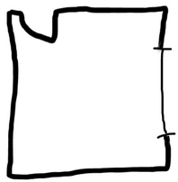
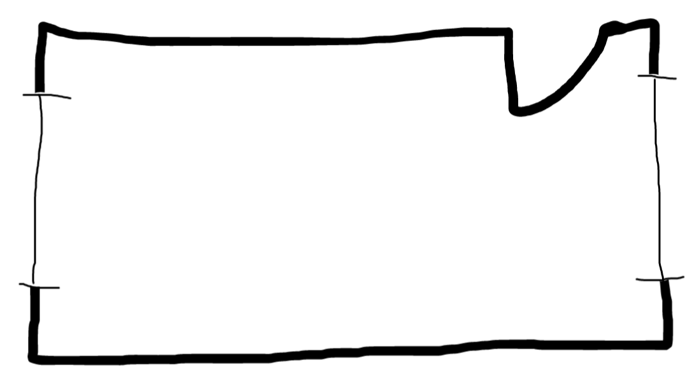

# Feng Shui Calculator Documentation

### In progress:
- [ ] Implement a system to represent rooms in code

### To do:
- [ ] Create an evaluation function that determines how well a given bed placement adheres to the rules of Feng Shui
- [ ] Create an API that takes room configuration as an input and produces the optimal bed placement as an output
- [ ] Create a web app that allows users to input their room configuration and see the optimal bed placement

## Room Representation
### Current Limitations
In its current state, this app can only represent rectangular rooms. For the purpose of visualization, assume a birds-eye view of the room.

### Current Implementation
To represent a specific room, the following information is needed:
1. The ratio between the horizontal walls' lengths and the vertical walls' lengths
2. A list of features of the room’s walls and their locations.  
    a) To describe a feature’s location, use the distance from the upper left corner along the path tracing the walls clockwise. Location is in units as a percentage of the room’s total perimeter, to the nearest 3 significant figures.  
    b) To describe a feature’s length, the units are the percentage of the perimeter the feature takes up, to the nearest 3 significant figures.

The below are some examples, with estimations on location and length of features. The location and length of features are not exact, but are close enough to give a good idea of the room's layout.
#### Example 1

Dimension Ratio: 1  
Approximate Features:
<ol>
    <li> Entrance door position at position 2, width 8 </li>
    <li> Window at position 30, width 12 </li>
</ol>
Corners: [0, 25, 50, 75]

#### Example 2

Dimension Ratio: 2  
Approximate Features:
<ol>
    <li> Entrance door at position 25, width 4 </li>
    <li> Window at position 36, width 11 </li>
    <li> Window at position 86, width 11 </li>
</ol>
Corners: [0, 33.333, 50, 83.333]
